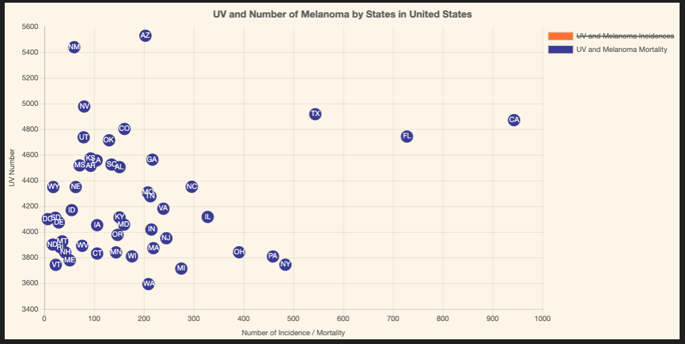

# UV Exposure and Melanoma: Analysis and Visualization

## Project Summary:
UV radiation exposure has been recognized as one of the leading causes of Melanoma.
In this project, our goal is to highlight relationships between UV exposure and Melanoma incidence/mortality rates specifically in the United States by interactive graphic visualization.

- Performing ETL (Extract, Transform, and Load) on the data.
- Creating Python Flask routes to load, create our own API, and direct to each html webpage.
- Presenting the analysis on graph visualization using multiple javascript libraries.

## Data Resources:
* https://data.world/albert/us-county-level-uv-exposure
* https://data.world/cdc/us-chronic-disease-indicators

## Process:

#### Extract and Transform
We data mined UV exposure data in the United States on a per-county level and calculated an aggregated average for each state. Futhermore, we acquiried US chronic disease indicators data which covers 124 indicators data collected by CDC’s Division of Population Health. From this report, we focused on and extracted the incidences and mortalities rates for Cancerous Melanoma per each state.

We used Jupyter Notebook as our testing worksheets before moving the process to a Python script file.
The data cleaning process was done using the Pandas library, then we loaded the data to MongoDB through the Jupyter Notebook environment.

Once everything worked accordingly in the Jupyter Notebook, we copied the codes to another Python script (“uv_melanoma_ETL.py”) and stored them in their own function (“get_data()”).

#### Load
We created a Flask app.py file to connect to the database (MongoDB), create collections, and load the cleaned data, which was later used in our visualizations. Multiple routes were created for the following purposes.

**@app.route("/api/upload_to_db")**

This is the first step when we run the server for the first time, in order to load the data to MongoDB. This route called the function “get_data()” from “uv_melanoma_ETL.py” which cleaned the data. After the data is uploaded successfully to MongoDB, the page will return a confirmation that data is uploaded.

To ensure the data is ready to be used for visualization, we created the following route which is also our API route:
**@app.route("/api/get_all_data")**

This will also be the route we will use in our javascript files later on to build our charts.

**@app.route("/")**

This is the route for our website homepage and the other remaining routes will direct to other pages which display other graphs.

#### Building Charts

The JavaScript libraries we use to visualize our data:
1. Leaflet and GeoJSON

2. Plotly

3. Chart.js

4. WebGL

