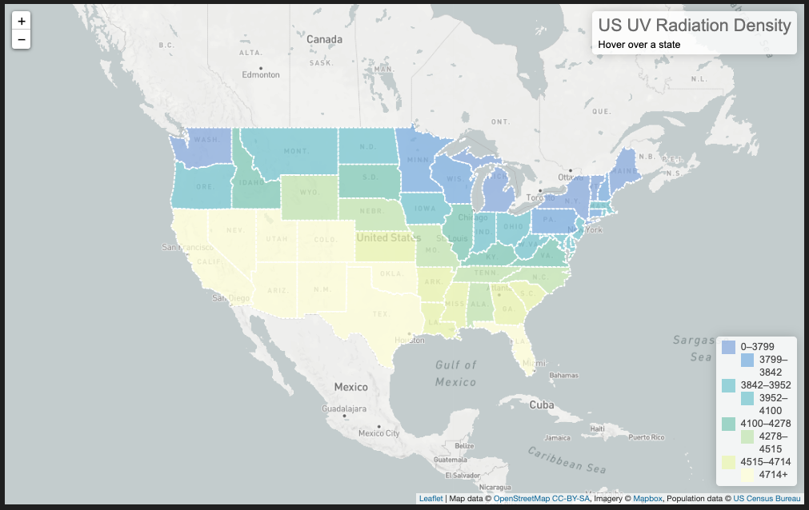
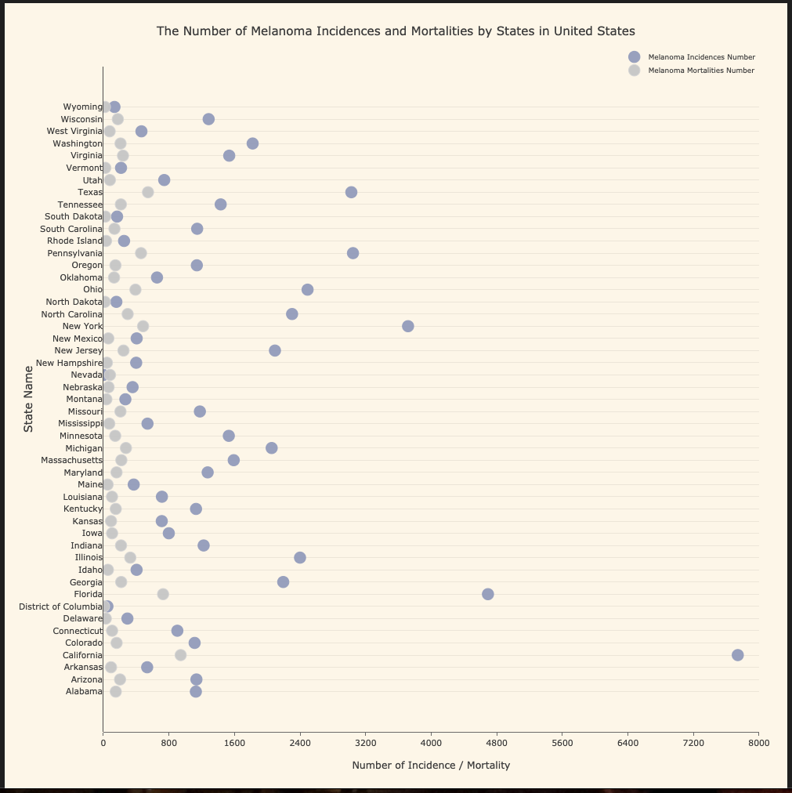
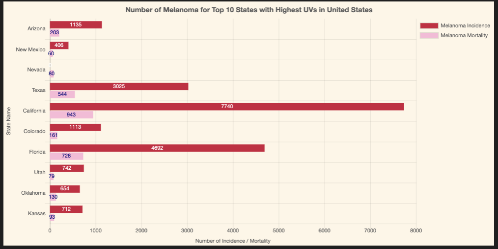

# UV Exposure and Melanoma Analysis and Visualization

## Project Summary:
UV Exposure has been recognized as one of the causes of Melanoma.
In this project, our goal is to show relationship between UV exposure and number of Melanoma specifically in United States by interactive graphs visualization.

- Performing ETL (Extract, Transform, and Load) on the data.
- Creating Python Flask routes to load, create our own API, and direct to each html webpage.
- Presenting the analysis on graph visualization using multiple javascript libraries.

## Data Resources:
* https://data.world/albert/us-county-level-uv-exposure
* https://data.world/cdc/us-chronic-disease-indicators

## Process:

#### Extract and Transform
We found UV exposure data in United States for each county and took the average of UV exposure to get the UV exposure for each state.

We found US chronic disease indicators data which covers 124 indicators data collected by CDC’s Division of Population Health. From this report, we focused on and extracted the incidences and mortalities number for Cancer Melanoma per each state.

We use jupyter notebook as our testing worksheets before moving the process to python file.
The data cleaning process was done using pandas, and we tried loading the data to MongoDB through jupyter notebook.

Once everything worked accordingly in jupyter notebook. We copied the codes to python file (“uv_melanoma_ETL.py”) and stored them in a function (“get_data()”).

#### Load
We created flask app.py file to connect to the database (MongoDB), create collections, and load the cleaned data, which we will use in our visualization. Multiple routes were created for the following purposes.

**@app.route("/api/upload_to_db")**

The first step when we run the server for the first time, in order to load the data to MongoDB. This route called the function “get_data()” from “uv_melanoma_ETL.py” which cleaned the data. After the data is uploaded successfully to MongoDB, the page will return a confirmation that data is uploaded.

To ensure the data is ready to be used for visualization, we created the following route which is also our API route.
**@app.route("/api/get_all_data")**

This will also be the route we will use in our javascript files later on to build our charts.

**@app.route("/")**

This is the route for our website homepage and the other remaining routes will direct to other pages which shows other graphs.

#### Building Charts

JavaScript Libraries we are using to visualize our data:
1. Leaflet and GeoJson

2. Plotly

3. Chart.js

4. WebGL

